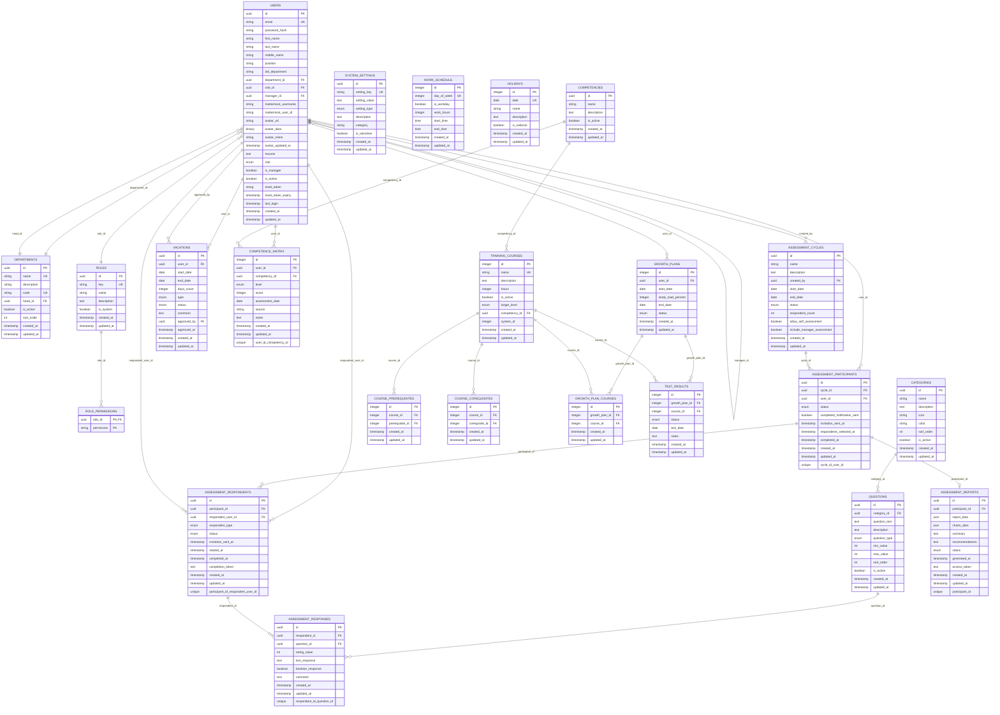
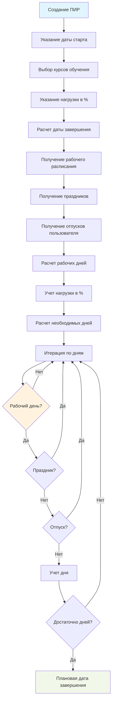
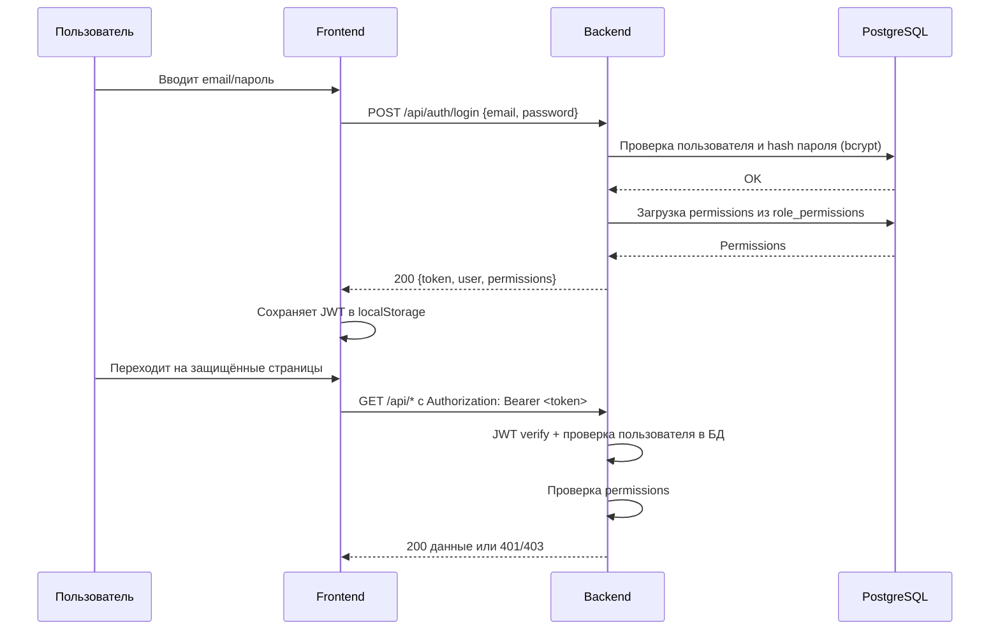
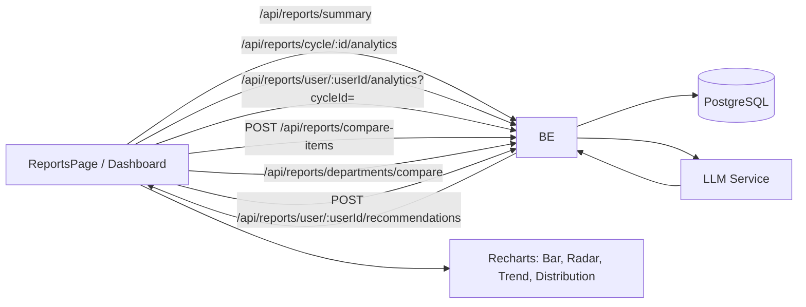
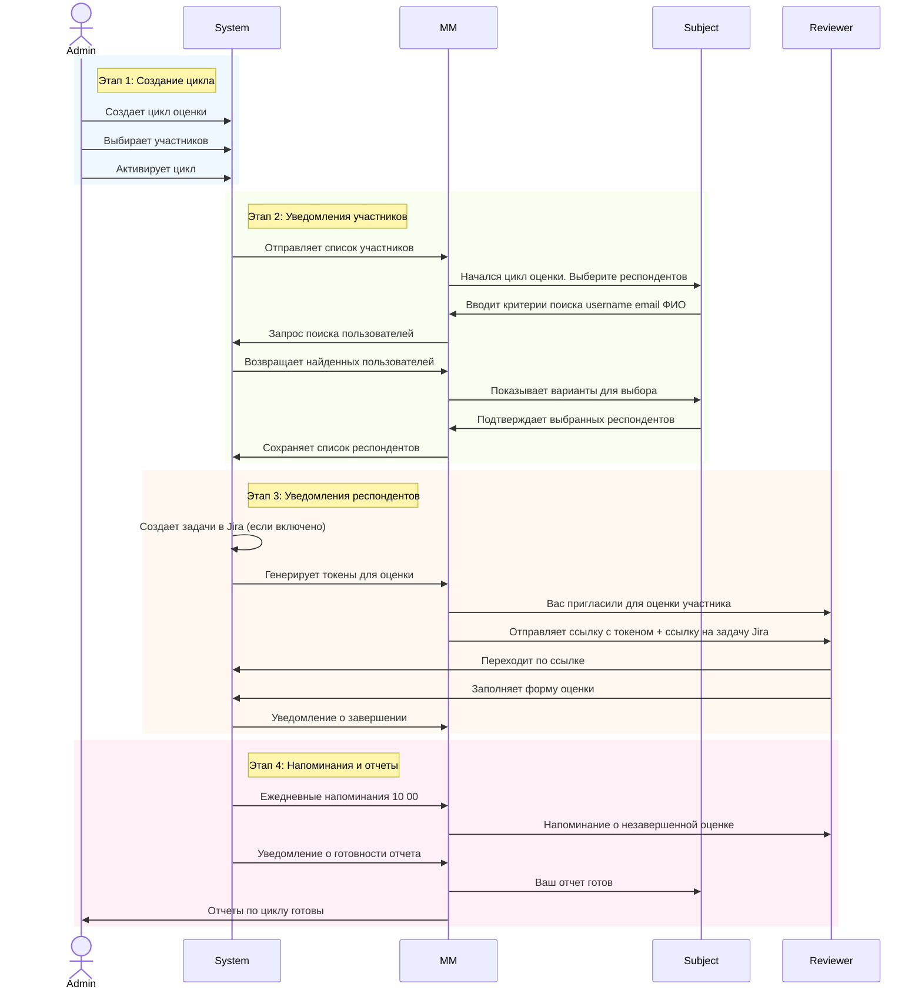

<!-- Автор: Стас Чашин @chastnik -->
# БИТ.Цифра: Система 360-градусной оценки персонала

Современная веб-система для проведения 360-градусной оценки персонала с интеграцией с Mattermost и Jira.

## 🚀 Возможности

### Основные функции
- **360-градусная оценка**: Комплексная система оценки сотрудников со всех сторон
- **Интерактивный выбор респондентов**: Выбор оценщиков через Mattermost-бота с поиском
- **Автоматизированные циклы**: Полный цикл от создания до отчетов с автоматизацией
- **Многоуровневая аналитика**: Индивидуальные, командные и межотдельские отчеты

### Управление персоналом
- **Система ролей**: Admin, HR, Manager, User с гранулярными правами через role_permissions
- **Управление отделами**: Иерархическая структура с руководителями
- **Публичные профили сотрудников**: Просмотр профилей любых сотрудников с информацией о компетенциях и резюме
- **Профили сотрудников**: Полные профили с интеграцией Mattermost и аватарами, редактирование резюме
- **Управление отпусками**: Пользователи могут указывать свои отпуска, админы/HR управляют отпусками сотрудников
- **Календарь и расписание**: Настройка рабочего расписания и праздников для расчета ПИР

### Интеграция и автоматизация
- **Mattermost интеграция**: Умный бот для выбора респондентов и уведомлений
- **Jira интеграция**: Автоматическое создание задач для респондентов при запуске оценки
- **Автоматические напоминания**: Настраиваемые уведомления о незавершенных оценках
- **CRON планировщик**: Автоматические задачи и мониторинг процессов

### Аналитика и отчетность
- **Интерактивные дашборды**: Визуализация данных с Recharts
- **Сравнительная аналитика**: Сравнение сотрудников и отделов
- **LLM-анализ**: Умная обработка текстовых ответов с учетом доступных курсов обучения
- **AI рекомендации**: Персонализированные рекомендации по развитию на основе 360-оценки
- **Экспорт данных**: Различные форматы для дальнейшего анализа

### Администрирование
- **Гибкая конфигурация**: Настройка вопросов, категорий, параметров
- **Система настроек**: Централизованное управление конфигурацией
- **Мониторинг системы**: Отслеживание производительности и ошибок
- **Безопасность**: JWT аутентификация, защита данных, rate limiting, Helmet, CORS
- **Календарь**: Управление рабочим расписанием и праздниками
- **Планы индивидуального роста (ПИР)**: Автоматический расчет даты завершения с учетом календаря и отпусков
- **Управление компетенциями**: Система компетенций с матрицей уровней
- **Курсы обучения**: Управление курсами с зависимостями и целевыми уровнями

## 🛠 Технологии

### Backend
- **Node.js** + **TypeScript** - основная среда выполнения
- **Express.js** - веб-фреймворк с middleware
- **PostgreSQL** - основная база данных с UUID
- **Redis** - кэширование и сессии (опционально)
- **Knex.js** - ORM, миграции и query builder
- **JWT** - stateless аутентификация
- **Bcrypt** - хэширование паролей
- **node-cron** - планировщик задач
- **Helmet** - защита HTTP заголовков
- **express-rate-limit** - ограничение частоты запросов
- **Joi** - валидация входных данных
- **Morgan** - логирование HTTP запросов
- **Pino** - структурированное логирование (JSON в production, красивый вывод в development)

### Frontend
- **React** + **TypeScript** - основной UI фреймворк
- **React Router v6** - клиентская маршрутизация
- **Axios** - HTTP клиент с interceptors
- **Recharts** - графики и диаграммы
- **Tailwind CSS** - utility-first стилизация
- **React Context** - управление состоянием
- **html2canvas** + **jspdf** - экспорт в PDF

### Интеграции
- **Mattermost API** - корпоративный мессенджер
- **Jira API** - система управления задачами (автоматическое создание задач для респондентов)
- **LLM Services** - обработка естественного языка
- **Docker** - контейнеризация (опционально)
- **Nginx** - reverse proxy и статические файлы

### DevOps
- **ESLint** + **TypeScript ESLint** - качество кода
- **Git** - система контроля версий
- **Shell Scripts** - автоматизация развертывания

## 🧩 Архитектура системы

### Общая архитектура

```mermaid
graph TD
  subgraph "Клиентская часть"
    A[Web Browser] --> B[React Frontend<br/>:3000 / :80]
    B1[Admin Panel] --> B
    B2[User Dashboard] --> B
    B3[Assessment Form] --> B
  end
  
  subgraph "Серверная часть"
    B -->|HTTP/REST API| C[Express Backend<br/>:5000]
    C --> C1[Helmet<br/>Security Headers]
    C --> C2[CORS<br/>Cross-Origin]
    C --> C3[Rate Limiting<br/>DDoS Protection]
    C --> C4[Validation<br/>Joi Middleware]
    C --> C5[Authentication<br/>JWT Middleware]
    C --> C6[Role-based<br/>Authorization]
    C --> C7[API Routes]
    C --> C8[Business Logic<br/>Services]
    C --> C9[Error Handler<br/>Unified Error Processing]
    C --> C10[Pino Logger<br/>Structured Logging]
  end
  
  subgraph "Хранилище данных"
    C --> D[(PostgreSQL<br/>Основная БД)]
    C --> E[(Redis<br/>Кэш & Сессии)]
  end
  
  subgraph "Внешние сервисы"
    C --> F[Mattermost API<br/>Уведомления]
    C --> F1[Jira API<br/>Создание задач]
    C --> G[LLM Service<br/>Аналитика и рекомендации]
    C --> H[CRON Scheduler<br/>Автоматизация]
  end
  
  subgraph "Календарь и ПИР"
    C --> I1[Calendar Service<br/>Расписание и праздники]
    C --> J1[Vacation Management<br/>Управление отпусками]
    C --> K1[Growth Plans<br/>ПИР с учетом календаря]
  end
  
  subgraph "Администрирование"
    L[System Settings] --> C
    M[Role Management] --> C
    N[Department Management] --> C
    O[Competencies] --> C
    P[Training Courses] --> C
  end
```



### Структура базы данных



### Расчет планов индивидуального роста (ПИР)



### JWT аутентификация (последовательность)



### Процесс 360-градусной оценки

```mermaid
flowchart TD
  subgraph "Этап 1: Подготовка"
    A1[Администратор создает<br/>цикл оценки] --> A2[Настройка параметров<br/>цикла]
    A2 --> A3[Выбор участников]
    A3 --> A4[Активация цикла]
  end
  
  subgraph "Этап 2: Выбор респондентов"
    A4 --> B1[Участники получают<br/>уведомления в Mattermost]
    B1 --> B2[Участник выбирает<br/>респондентов через бота]
    B2 --> B3{Минимум 4<br/>респондента?}
    B3 -->|Нет| B2
    B3 -->|Да| B4[Подтверждение<br/>списка респондентов]
  end
  
  subgraph "Этап 3: Проведение оценки"
    B4 --> C0{Интеграция Jira<br/>включена?}
    C0 -->|Да| C0a[Создание задач<br/>в Jira для респондентов]
    C0 -->|Нет| C1
    C0a --> C1[Респонденты получают<br/>уведомления с ссылками<br/>и ссылками на задачи Jira]
    C1 --> C2[Респондент заполняет<br/>форму оценки]
    C2 --> C3{Все категории<br/>заполнены?}
    C3 -->|Нет| C2
    C3 -->|Да| C4[Оценка сохранена]
  end
  
  subgraph "Этап 4: Мониторинг"
    C4 --> D1[Автоматические напоминания<br/>неответившим]
    D1 --> D2{Все респонденты<br/>ответили?}
    D2 -->|Нет| D1
    D2 -->|Да| D3[Участник помечается<br/>как завершен]
    D3 --> D4[Отправка уведомления<br/>о готовности отчета]
  end
  
  subgraph "Этап 5: Результаты"
    D4 --> E1[Генерация отчетов<br/>и аналитики]
    E1 --> E2[LLM-анализ текстовых<br/>ответов]
    E2 --> E3[AI рекомендации<br/>с учетом курсов]
    E3 --> E4[Доступ к детальным<br/>отчетам и дашбордам]
  end
  
  style A4 fill:#e1f5fe
  style C4 fill:#f1f8e9
  style E4 fill:#fff3e0
```



### Система ролей и разрешений

```mermaid
graph TB
  subgraph "Роли в системе"
    R1[Admin<br/>Полные права]
    R2[HR<br/>Управление персоналом]
    R3[Manager<br/>Управление командой]
    R4[User<br/>Базовые права]
  end
  
  subgraph "Разрешения Admin"
    P1[Управление пользователями]
    P2[Управление системными настройками]
    P3[Управление ролями]
    P4[Управление отделами]
    P5[Создание/изменение циклов]
    P6[Доступ ко всем отчетам]
    P7[Управление категориями и вопросами]
    P8[Интеграция с Mattermost]
    P9[Управление календарем]
    P10[Управление отпусками]
    P11[Управление компетенциями]
    P12[Управление курсами]
  end
  
  subgraph "Разрешения HR"
    P13[Просмотр пользователей]
    P14[Создание циклов оценки]
    P15[Просмотр отчетов отделов]
    P16[Управление участниками]
    P17[Управление отпусками сотрудников]
  end
  
  subgraph "Разрешения Manager"
    P18[Просмотр своей команды]
    P19[Участие в оценке]
    P20[Просмотр отчетов подчиненных]
  end
  
  subgraph "Разрешения User"
    P21[Участие в оценке]
    P22[Просмотр своих результатов]
    P23[Заполнение форм оценки]
    P24[Управление своими отпусками]
  end
  
  R1 --> P1
  R1 --> P2
  R1 --> P3
  R1 --> P4
  R1 --> P5
  R1 --> P6
  R1 --> P7
  R1 --> P8
  R1 --> P9
  R1 --> P10
  R1 --> P11
  R1 --> P12
  
  R2 --> P13
  R2 --> P14
  R2 --> P15
  R2 --> P16
  R2 --> P17
  
  R3 --> P18
  R3 --> P19
  R3 --> P20
  
  R4 --> P21
  R4 --> P22
  R4 --> P23
  R4 --> P24
  
  style R1 fill:#ffebee
  style R2 fill:#e8f5e8
  style R3 fill:#fff3e0
  style R4 fill:#e3f2fd
```



### Потоки данных отчетов и аналитики



### API Архитектура

```mermaid
graph TD
  subgraph Frontend_Routes
    F1[login] --> F2[dashboard]
    F2 --> F3[assessments]
    F2 --> F4[reports]
    F2 --> F5[admin]
    F3 --> F6[survey_token]
    F2 --> F7[learning]
    F2 --> F8[calendar]
  end
  
  subgraph API_Endpoints
    subgraph Authentication
      A1[POST /api/auth/login]
      A2[POST /api/auth/register]
      A3[POST /api/auth/forgot-password]
      A4[POST /api/auth/reset-password]
      A5[POST /api/auth/change-password]
    end
    
    subgraph User_Management
      U1[GET /api/users]
      U2[POST /api/users]
      U3[PUT /api/users/:id]
      U4[DELETE /api/users/:id]
      U5[PUT /api/users/password]
    end
    
    subgraph Assessment_Cycles
      C1[GET /api/cycles]
      C2[POST /api/cycles]
      C3[PUT /api/cycles/:id]
      C4[POST /api/cycles/:id/start]
      C5[POST /api/cycles/:id/participants]
    end
    
    subgraph Assessments
      AS1[GET /api/assessments]
      AS2[POST /api/assessments/submit]
      AS3[GET /api/assessments/:token]
    end
    
    subgraph Reports_and_Analytics
      R1[GET /api/reports/summary]
      R2[GET /api/reports/cycle/:id/analytics]
      R3[GET /api/reports/user/:id/analytics]
      R4[POST /api/reports/compare-items]
      R5[GET /api/reports/departments/compare]
      R6[POST /api/reports/user/:userId/recommendations]
    end
    
    subgraph Admin_Endpoints
      AD1[GET /api/admin/dashboard]
      AD2[GET /api/categories]
      AD3[GET /api/questions]
      AD4[GET /api/departments]
      AD5[GET /api/roles]
      AD6[GET /api/settings]
    end
    
    subgraph Mattermost_Endpoints
      MM1[GET /api/mattermost/integration-stats]
      MM2[POST /api/mattermost/test-connection]
      MM3[POST /api/mattermost/sync-users]
      MM4[POST /api/mattermost/sync-team-users]
      MM5[POST /api/mattermost/send-notification]
      MM6[POST /api/mattermost/sync-avatar/:userId]
    end
    
    subgraph Jira_Endpoints
      J1[GET /api/jira/settings]
      J2[PUT /api/jira/settings]
      J3[POST /api/jira/test-connection]
      J4[GET /api/jira/projects]
      J5[GET /api/jira/projects/:projectKey/epics]
    end
    
    subgraph Calendar_Endpoints
      CAL1[GET /api/calendar/work-schedule]
      CAL2[PUT /api/calendar/work-schedule]
      CAL3[GET /api/calendar/holidays]
      CAL4[POST /api/calendar/holidays]
      CAL5[PUT /api/calendar/holidays/:id]
      CAL6[DELETE /api/calendar/holidays/:id]
    end
    
    subgraph Vacation_Endpoints
      VAC1[GET /api/vacations]
      VAC2[POST /api/vacations]
      VAC3[PUT /api/vacations/:id]
      VAC4[DELETE /api/vacations/:id]
      VAC5[GET /api/vacations/stats/summary]
    end
    
    subgraph Learning_Endpoints
      L1[GET /api/learning/users]
      L2[GET /api/learning/competencies]
      L3[GET /api/learning/courses]
      L4[GET /api/learning/growth-plans]
      L5[POST /api/learning/growth-plans]
      L6[PUT /api/learning/growth-plans/:id]
      L7[DELETE /api/learning/growth-plans/:id]
    end
  end
  
  subgraph Middleware_Stack
    M1[Helmet<br/>Security Headers]
    M2[CORS<br/>Cross-Origin]
    M3[Body Parser<br/>JSON/URL-encoded]
    M4[Rate Limiting<br/>1000 req/min<br/>Strict for auth]
    M5[Validation<br/>Joi Schema]
    M6[Authentication<br/>JWT Verify]
    M7[Role Authorization<br/>requireRole]
    M8[Permission Check<br/>requirePermission]
    M9[Error Handler<br/>Unified Processing]
    M10[Pino Logger<br/>Structured Logging]
  end
  
  F1 --> A1
  F2 --> R1
  F3 --> AS1
  F4 --> R2
  F5 --> AD1
  F6 --> AS3
  F7 --> L4
  F8 --> CAL1
  
  A1 --> M1
  M1 --> M2
  M2 --> M3
  M3 --> M4
  M4 --> M5
  M5 --> M6
  M6 --> M7
  M7 --> M8
  M8 --> M9
  M9 --> M10
```



### Интеграция с Mattermost



## 📦 Установка и запуск

### Предварительные требования

#### Для Docker установки (рекомендуется)
- Docker 20.10+ и Docker Compose v2
- Порты: 80 (frontend), 5000 (backend), 5432 (PostgreSQL), 6379 (Redis)

#### Для установки без Docker
- Node.js >= 16.0.0
- PostgreSQL >= 12
- Redis (опционально)
- npm или yarn

### Быстрый старт с Docker (рекомендуется)

1. **Клонируйте репозиторий:**
```bash
git clone https://github.com/chastnik/360.git
cd 360
```

2. **Настройте окружение:**
```bash
cp env.example .env
# Отредактируйте .env файл с вашими настройками
# Обязательно измените: DB_PASSWORD, JWT_SECRET, REDIS_PASSWORD
```

3. **Автоматическая установка и запуск:**
```bash
# Используйте скрипт для автоматической установки
./docker-setup.sh

# Или вручную:
docker compose up -d --build
```

4. **Выполните миграции базы данных:**
```bash
# Автоматически через скрипт
./docker-setup.sh migrate

# Или вручную:
docker compose exec backend npm run migrate
docker compose exec backend npm run seed
```

Система будет доступна по адресам:
- **Frontend**: http://localhost
- **Backend API**: http://localhost:5000/api

**Учетные данные по умолчанию** (после выполнения seed):
- Email: `admin@company.com` / Пароль: `admin123`
- Email: `manager@company.com` / Пароль: `manager123`
- Email: `user@company.com` / Пароль: `user123`

### Установка без Docker

1. **Клонируйте репозиторий:**
```bash
git clone https://github.com/chastnik/360.git
cd 360
```

2. **Настройте окружение:**
```bash
cp env.example .env
# Отредактируйте .env файл с вашими настройками
```

3. **Установите зависимости:**
```bash
npm run install:all
```

4. **Настройте базу данных:**
```bash
# Создайте базу данных PostgreSQL
createdb assessment360

# Выполните миграции
cd backend && npm run migrate && npm run seed
```

5. **Запустите систему:**
```bash
# Используйте скрипт для разработки
./dev.sh

# Или вручную:
# Backend (в одном терминале)
cd backend && npm run dev

# Frontend (в другом терминале)
cd frontend && npm start
```

Система будет доступна по адресам:
- **Frontend**: http://localhost:3000 (dev) или http://localhost:80 (production)
- **Backend API**: http://localhost:5000/api

### Альтернативные способы запуска

#### Продакшн режим (без Docker)
```bash
./start.sh --production
```

#### Docker Compose (рекомендуется для продакшн)
```bash
# Запуск
docker compose up -d

# Просмотр логов
docker compose logs -f

# Остановка
docker compose down
```

Подробные инструкции по развертыванию:
- **Docker**: см. [DEPLOYMENT_DOCKER.md](DEPLOYMENT_DOCKER.md)
- **Без Docker**: см. [DEPLOYMENT_BARE.md](DEPLOYMENT_BARE.md)
- **Общая информация**: см. [DEPLOYMENT.md](DEPLOYMENT.md)

## ⚙️ Конфигурация

Основные настройки в `.env` файле:

```env
# База данных
DB_HOST=localhost
DB_NAME=assessment360
DB_USER=assessment_user
DB_PASSWORD=your_secure_db_password_here
DB_PORT=5432

# Порты
PORT=5000
FRONTEND_PORT=80
BACKEND_PORT=5000

# JWT
JWT_SECRET=your-super-secret-jwt-key-change-this-in-production-minimum-32-characters

# Frontend
REACT_APP_API_URL=http://localhost:5000/api
FRONTEND_URL=http://localhost

# Redis
REDIS_PASSWORD=your_redis_password_here
REDIS_PORT=6379

# Mattermost интеграция
MATTERMOST_URL=https://your-mattermost-server.com
MATTERMOST_TOKEN=your-mattermost-personal-access-token
MATTERMOST_TEAM_ID=your-team-id-here
MATTERMOST_BOT_USERNAME=360-assessment-bot

# Jira интеграция (настройки хранятся в БД через админ-панель)
# Настройка выполняется через /admin/integrations/jira

# Encryption Key для Jira (128-bit, 32 hex символа)
# ОБЯЗАТЕЛЬНО должен быть установлен перед запуском
# Генерация: openssl rand -hex 16
ENCRYPTION_KEY=your-32-hex-character-encryption-key-here

# Конфигурация для production
NODE_ENV=production

# Логирование (Pino)
LOG_LEVEL=info
# Уровни: trace, debug, info, warn, error, fatal
# В development: автоматически используется 'debug'
# В production: рекомендуется 'info' или 'warn'

# Конфигурация безопасности
CORS_ORIGIN=http://localhost:3000,https://your-domain.com
RATE_LIMIT_WINDOW=900000
RATE_LIMIT_MAX=100
```

## 🗄 База данных

### Настройка PostgreSQL

1. Создайте базу данных:
```sql
CREATE DATABASE assessment360;
CREATE USER assessment_user WITH PASSWORD 'your_secure_db_password_here';
GRANT ALL PRIVILEGES ON DATABASE assessment360 TO assessment_user;
```

2. Запустите миграции:

**Автоматическое развертывание (рекомендуется):**

```bash
cd backend
./scripts/deploy-migrations.sh --with-seeds
```

**Или вручную:**

```bash
cd backend
# Для development окружения
NODE_ENV=development npm run migrate

# Для production окружения
NODE_ENV=production npm run migrate

# Заполнение начальными данными
npm run seed
```

**Важно:** Миграция `20250131000000_add_performance_indexes.js` добавляет индексы для оптимизации производительности запросов. Рекомендуется выполнить её после основных миграций.

Подробная документация по миграциям: [backend/MIGRATIONS.md](backend/MIGRATIONS.md)

## 🔧 Разработка

### Структура проекта

```
360/
├── backend/          # Backend API (Node.js + Express)
│   ├── src/
│   │   ├── routes/   # API маршруты
│   │   ├── services/ # Бизнес-логика
│   │   ├── middleware/ # Middleware
│   │   │   ├── auth.ts        # JWT аутентификация
│   │   │   ├── errorHandler.ts # Единый обработчик ошибок
│   │   │   └── validation.ts  # Валидация Joi
│   │   ├── utils/    # Утилиты
│   │   │   ├── logger.ts      # Pino логирование
│   │   │   └── passwordValidation.ts # Проверка паролей
│   │   ├── database/ # Миграции и seeds
│   │   │   └── migrations/
│   │   │       └── 20250131000000_add_performance_indexes.js
│   │   └── types/    # TypeScript типы
│   ├── dist/         # Скомпилированный код
│   └── package.json
├── frontend/         # Frontend (React)
│   └── src/
│       ├── components/ # React компоненты
│       ├── pages/     # Страницы приложения
│       ├── services/  # API клиент
│       ├── contexts/  # React Context
│       └── utils/     # Утилиты
├── docker-compose.yml # Docker конфигурация
├── nginx.conf        # Nginx конфигурация
├── env.example       # Пример конфигурации
├── CODE_REVIEW.md    # Отчет о code review и исправлениях
├── DEPLOYMENT.md     # Общая документация по развертыванию
├── DEPLOYMENT_DOCKER.md # Развертывание с Docker
├── DEPLOYMENT_BARE.md   # Развертывание без Docker
├── STARTUP_GUIDE.md  # Руководство по запуску
└── INSTALL.md        # Подробная инструкция по установке
```

### Полезные команды

```bash
# Установка зависимостей
npm run install:all

# Запуск в режиме разработки
./dev.sh

# Сборка проекта
cd backend && npm run build
cd frontend && npm run build

# Миграции базы данных
cd backend && npm run migrate

# Заполнение тестовыми данными
cd backend && npm run seed

# Линтинг
cd backend && npm run lint
```

## 🔌 API Документация

### Основные эндпоинты

#### Аутентификация
- `POST /api/auth/login` - Вход в систему
- `POST /api/auth/register` - Регистрация нового пользователя
- `POST /api/auth/forgot-password` - Восстановление пароля
- `POST /api/auth/reset-password` - Сброс пароля по токену
- `POST /api/auth/change-password` - Смена пароля (требует аутентификации)

#### Пользователи и роли
- `GET /api/users` - Список пользователей (с фильтрацией и пагинацией)
- `GET /api/users/:id` - Получить данные пользователя (публичный профиль)
- `GET /api/users/profile` - Получить профиль текущего пользователя
- `PUT /api/users/profile` - Обновить профиль текущего пользователя (включая резюме)
- `POST /api/users` - Создание пользователя (требует permission: action:users:create)
- `PUT /api/users/:id` - Обновление данных пользователя
- `DELETE /api/users/:id` - Деактивация пользователя
- `PUT /api/users/password` - Смена пароля текущего пользователя
- `GET /api/roles` - Управление ролями и разрешениями
- `POST /api/roles` - Создание роли
- `PUT /api/roles/:id` - Обновление роли
- `DELETE /api/roles/:id` - Удаление роли
- `POST /api/roles/:id/permissions` - Добавление разрешения к роли
- `DELETE /api/roles/:id/permissions/:permission` - Удаление разрешения из роли

#### Отделы
- `GET /api/departments` - Список отделов
- `POST /api/departments` - Создание отдела
- `PUT /api/departments/:id` - Обновление отдела
- `DELETE /api/departments/:id` - Удаление отдела

#### Циклы оценки
- `GET /api/cycles` - Все циклы оценки
- `POST /api/cycles` - Создание цикла
- `PUT /api/cycles/:id` - Обновление цикла
- `POST /api/cycles/:id/start` - Запуск цикла оценки
- `POST /api/cycles/:id/participants` - Управление участниками

#### Оценки
- `GET /api/assessments` - Доступные оценки для пользователя
- `GET /api/assessments/:token` - Получение формы оценки по токену
- `POST /api/assessments/submit` - Отправка заполненной оценки

#### Отчеты и аналитика
- `GET /api/reports/summary` - Общая сводка для дашборда
- `GET /api/reports/cycle/:id/analytics` - Детальная аналитика по циклу
- `GET /api/reports/user/:id/analytics` - Индивидуальная аналитика сотрудника
- `POST /api/reports/user/:userId/recommendations` - AI рекомендации для сотрудника с учетом курсов
- `POST /api/reports/compare-items` - Сравнение произвольного набора сотрудников
- `GET /api/reports/departments/compare` - Сравнительная аналитика отделов

#### Администрирование
- `GET /api/admin/dashboard` - Административная панель
- `GET /api/categories` - Управление категориями вопросов
- `POST /api/categories` - Создание категории
- `PUT /api/categories/:id` - Обновление категории
- `DELETE /api/categories/:id` - Удаление категории
- `GET /api/questions` - Управление вопросами
- `POST /api/questions` - Создание вопроса
- `PUT /api/questions/:id` - Обновление вопроса
- `DELETE /api/questions/:id` - Удаление вопроса
- `GET /api/settings` - Системные настройки
- `PUT /api/settings/:key` - Обновление настройки

#### Интеграция с Mattermost
- `GET /api/mattermost/integration-stats` - Статистика интеграции
- `POST /api/mattermost/test-connection` - Тест подключения к Mattermost
- `POST /api/mattermost/sync-users` - Синхронизация пользователей
- `POST /api/mattermost/sync-team-users` - Синхронизация пользователей команды
- `POST /api/mattermost/send-notification` - Отправка уведомления
- `POST /api/mattermost/sync-avatar/:userId` - Синхронизация аватара пользователя
- `POST /api/mattermost/webhook` - Webhook для интеграции с Mattermost

#### Интеграция с Jira
- `GET /api/jira/settings` - Получить настройки Jira интеграции
- `PUT /api/jira/settings` - Сохранить настройки Jira интеграции
- `POST /api/jira/test-connection` - Тест подключения к Jira
- `GET /api/jira/projects` - Получить список проектов Jira
- `GET /api/jira/projects/:projectKey/epics` - Получить список эпиков проекта

#### Календарь и расписание
- `GET /api/calendar/work-schedule` - Получить рабочее расписание
- `PUT /api/calendar/work-schedule` - Обновить рабочее расписание
- `GET /api/calendar/holidays?year=YYYY` - Получить праздники за год
- `POST /api/calendar/holidays` - Создать праздник
- `PUT /api/calendar/holidays/:id` - Обновить праздник
- `DELETE /api/calendar/holidays/:id` - Удалить праздник

#### Управление отпусками
- `GET /api/vacations?user_id=...&year=...&status=...` - Получить отпуска (с фильтрацией)
- `GET /api/vacations/:id` - Получить отпуск по ID
- `POST /api/vacations` - Создать отпуск
- `PUT /api/vacations/:id` - Обновить отпуск
- `DELETE /api/vacations/:id` - Удалить отпуск
- `GET /api/vacations/stats/summary?year=YYYY` - Статистика отпусков

#### Обучение и ПИР
- `GET /api/learning/users` - Получить список пользователей для ПИР
- `GET /api/learning/competencies` - Получить список компетенций
- `GET /api/learning/courses` - Получить список курсов обучения
- `GET /api/learning/growth-plans` - Получить планы индивидуального роста
- `POST /api/learning/growth-plans` - Создать план индивидуального роста
- `PUT /api/learning/growth-plans/:id` - Обновить план индивидуального роста
- `DELETE /api/learning/growth-plans/:id` - Удалить план индивидуального роста

### Примеры запросов

```javascript
// Аутентификация
POST /api/auth/login
{
  "email": "user@example.com",
  "password": "password"
}

// Создание цикла оценки
POST /api/cycles
{
  "name": "Q1 2024 Assessment",
  "start_date": "2024-01-01",
  "end_date": "2024-03-31",
  "respondent_count": 5,
  "allow_self_assessment": true,
  "include_manager_assessment": true
}

// Аналитика цикла
GET /api/reports/cycle/a544e33a-dee5-45cd-91ab-ba478b05bd8d/analytics

// Аналитика сотрудника (последний цикл)
GET /api/reports/user/550e8400-e29b-41d4-a716-446655440200/analytics

// Аналитика сотрудника в указанном цикле
GET /api/reports/user/550e8400-e29b-41d4-a716-446655440200/analytics?cycleId=a544e33a-dee5-45cd-91ab-ba478b05bd8d

// Сравнение произвольного набора сотрудников
POST /api/reports/compare-items
{
  "items": [
    {"userId": "...", "cycleId": "..."},
    {"userId": "..."}
  ]
}

// Сравнение отделов
GET /api/reports/departments/compare?cycleId=...&departmentIds=dep1,dep2

// AI рекомендации с учетом курсов
POST /api/reports/user/:userId/recommendations
{
  "cycleId": "..."
}

// Управление календарем
GET /api/calendar/work-schedule
PUT /api/calendar/work-schedule
{
  "schedule": [
    {"day_of_week": 1, "is_workday": true, "work_hours": 8, "start_time": "09:00:00", "end_time": "18:00:00"},
    {"day_of_week": 2, "is_workday": true, "work_hours": 8, "start_time": "09:00:00", "end_time": "18:00:00"}
  ]
}

// Управление праздниками
GET /api/calendar/holidays?year=2025
POST /api/calendar/holidays
{
  "date": "2025-01-01",
  "name": "Новый год",
  "description": "Государственный праздник",
  "is_national": true
}

// Управление отпусками
GET /api/vacations?user_id=...&year=2025
POST /api/vacations
{
  "user_id": "...",
  "start_date": "2025-07-01",
  "end_date": "2025-07-14",
  "type": "vacation",
  "comment": "Ежегодный отпуск"
}

// Создание ПИР
POST /api/learning/growth-plans
{
  "user_id": "...",
  "start_date": "2025-01-01",
  "study_load_percent": 20,
  "courses": [1, 2, 3]
}
```

## 🔒 Безопасность

Система использует следующие механизмы безопасности:

### Аутентификация и авторизация
- **JWT токены** с сроком действия 24 часа
- **Bcrypt** для хеширования паролей (10 раундов)
- **Система ролей** с гранулярными правами через `role_permissions`
- **Middleware** для проверки прав доступа

### Защита данных
- **Helmet** для установки защитных HTTP заголовков
- **CORS** с настройкой разрешенных источников
- **Rate Limiting** (1000 запросов в минуту с одного IP, строгие лимиты для auth endpoints)
- **Валидация входных данных** через Joi с единым middleware
- **Параметризованные SQL запросы** через Knex для защиты от SQL-инъекций
- **Проверка сложности паролей** (минимум 8 символов, заглавные, строчные, цифры, спецсимволы)
- **Структурированное логирование** (Pino) без утечки чувствительных данных

### Безопасное хранение
- Секреты хранятся в переменных окружения (`.env`)
- Пароли никогда не хранятся в открытом виде
- JWT секрет хранится отдельно от кода
- **ENCRYPTION_KEY** для Jira интеграции (128-bit, обязателен)
- Шифрование чувствительных данных (пароли Jira) с использованием AES-128-CBC

### Логирование и мониторинг
- **Pino** для структурированного логирования
- JSON формат в production для парсинга логов
- Красивый вывод в development (pino-pretty)
- Разные уровни логирования (trace, debug, info, warn, error, fatal)
- Единый error handler для обработки всех ошибок

## 🤖 Интеграции

### Интеграция с Mattermost

Система поддерживает интеграцию с Mattermost для:

- Автоматических уведомлений о новых оценках
- Напоминаний о незавершенных оценках
- Интерактивного выбора респондентов через бота
- Публикации результатов (с настройкой приватности)
- Включения ссылок на задачи Jira в уведомлениях

### Настройка Mattermost

1. Создайте бота в Mattermost
2. Получите токен доступа
3. Добавьте настройки в `.env` файл:
```env
MATTERMOST_URL=https://your-mattermost-server.com
MATTERMOST_TOKEN=your-mattermost-personal-access-token
MATTERMOST_TEAM_ID=your-team-id-here
MATTERMOST_BOT_USERNAME=360-assessment-bot
```
4. Настройте интеграцию в административной панели: `/admin/integrations/mattermost`

### Интеграция с Jira

Система поддерживает интеграцию с Jira для:

- Автоматического создания задач для респондентов при запуске оценки
- Связывания задач с указанным проектом и эпиком
- Включения ссылок на задачи Jira в уведомлениях Mattermost

#### Настройка Jira

1. Перейдите в административную панель: `/admin/integrations/jira`
2. Введите настройки подключения:
   - **URL сервера Jira**: адрес вашего Jira сервера
   - **Имя пользователя**: логин для подключения
   - **Пароль**: пароль или API токен
3. Включите интеграцию переключателем "Jira integration enabled"
4. Выберите проект и эпик, где будут создаваться задачи
5. Нажмите "Сохранить настройки"

#### Автоматическое создание задач

При добавлении респондентов к участнику оценки:
1. Система проверяет, включена ли интеграция Jira
2. Для каждого респондента создается задача в указанном проекте и эпике
3. Задача назначается респонденту (поиск по email)
4. Название задачи: "360 оценка сотрудника _Имя Фамилия_"
5. Ссылка на задачу включается в уведомление Mattermost

**Настройки Jira хранятся в `system_settings` с категорией `integrations`:**
- `jira_url` - URL сервера Jira
- `jira_username` - имя пользователя
- `jira_password` - зашифрованный пароль
- `jira_enabled` - включена ли интеграция (true/false)
- `jira_project_key` - ключ проекта для создания задач
- `jira_epic_key` - ключ эпика для привязки задач

## 📊 Мониторинг

Система включает встроенный мониторинг:

```bash
# Запуск мониторинга
./monitoring.sh

# Просмотр логов
tail -f backend/logs/application.log
tail -f backend/dev.log
```

## 🚀 Деплой

### Docker (рекомендуется)

```bash
# Автоматическая установка и запуск
./docker-setup.sh

# Или вручную:
# Сборка и запуск
docker compose up -d --build

# Просмотр логов
docker compose logs -f

# Проверка статуса
docker compose ps

# Остановка
docker compose down
```

### Ручной деплой

```bash
# Сборка
cd backend && npm run build
cd frontend && npm run build

# Запуск в продакшн режиме
NODE_ENV=production npm start
```

Подробные инструкции по развертыванию см. в документации:
- [DEPLOYMENT_DOCKER.md](DEPLOYMENT_DOCKER.md) - развертывание с Docker
- [DEPLOYMENT_BARE.md](DEPLOYMENT_BARE.md) - развертывание без Docker
- [INSTALL.md](INSTALL.md) - подробная инструкция по установке

## 🤝 Вклад в проект

1. Fork репозитория
2. Создайте feature branch (`git checkout -b feature/amazing-feature`)
3. Commit изменения (`git commit -m 'Add amazing feature'`)
4. Push в branch (`git push origin feature/amazing-feature`)
5. Создайте Pull Request

## 📝 Лицензия

Этот проект лицензирован под MIT License - см. файл [LICENSE](LICENSE) для деталей.

## 🆘 Поддержка

Если у вас возникли проблемы:

1. Проверьте [Issues](https://github.com/chastnik/360/issues)
2. Создайте новый Issue с детальным описанием
3. Или свяжитесь с командой разработки

## 📈 Roadmap

### ✅ Реализовано
- [x] Управление отпусками пользователей
- [x] Календарь и рабочее расписание
- [x] Автоматический расчет ПИР с учетом календаря и отпусков
- [x] LLM-рекомендации с учетом курсов обучения
- [x] AI рекомендации для сотрудников
- [x] Интеграция отпусков в расчет ПИР
- [x] Система ролей с гранулярными правами
- [x] Управление компетенциями
- [x] Управление курсами обучения с зависимостями
- [x] Матрица компетенций
- [x] Аватары пользователей
- [x] Восстановление пароля
- [x] Публичные профили сотрудников
- [x] Редактирование резюме в профиле
- [x] Интеграция с Jira (автоматическое создание задач для респондентов)
- [x] Связывание задач Jira с уведомлениями Mattermost
- [x] Оптимизация производительности БД (индексы, устранение N+1 запросов)
- [x] Структурированное логирование (Pino)
- [x] Единый error handler
- [x] Валидация входных данных через Joi
- [x] Проверка сложности паролей
- [x] Улучшенная безопасность (rate limiting для auth endpoints)

### 🚧 В разработке
- [ ] Мобильное приложение
- [ ] Интеграция с Active Directory
- [ ] Расширенная аналитика
- [ ] Multi-tenant поддержка
- [ ] API v2 с GraphQL

## 🖥 UI и страницы

### Пользовательские страницы
- `/dashboard` — главная панель со сводкой, графиками и последней активностью
- `/profile` — личный профиль пользователя с возможностью редактирования, управления резюме и отпусками
- `/profile/:userId` — публичный профиль сотрудника (просмотр компетенций и резюме)
- `/assessments` — доступные оценки для заполнения
- `/cycles` — просмотр циклов оценки (участник/респондент)
- `/learning` — планы индивидуального роста (ПИР)

### Отчетность и аналитика  
- `/reports` — центр аналитики с множественными вкладками:
  - **Аналитика цикла** — детальные метрики по конкретному циклу
  - **Аналитика сотрудника** — индивидуальные профили с поиском и фильтрацией
  - **Сравнение сотрудников** — многомерное сравнение с радарными диаграммами
  - **Сравнение отделов** — межотдельская аналитика и бенчмаркинг
- `/employee/:userId` — персональная страница аналитики сотрудника

### Административные страницы
- `/admin` — главная административная панель с метриками системы
- `/admin/users` — управление пользователями (CRUD, роли, активация, отпуска)
- `/admin/departments` — управление структурой отделов
- `/admin/roles` — настройка ролей и разрешений
- `/admin/categories` — управление категориями вопросов
- `/admin/questions` — редактор вопросов для оценки
- `/admin/integrations` — раздел интеграций:
  - `/admin/integrations/mattermost` — настройки интеграции с Mattermost
  - `/admin/integrations/jira` — настройки интеграции с Jira
- `/admin/settings` — системные настройки и конфигурация
- `/admin/calendar` — управление рабочим расписанием и праздниками
- `/admin/learning` — управление компетенциями и курсами обучения

### Специальные страницы
- `/survey/:token` — публичная форма для заполнения оценки
- `/report/:token` — публичный просмотр отчета по токену
- `/login` — страница входа в систему
- `/register` — регистрация новых пользователей
- `/forgot-password` — восстановление пароля

---

**Система 360-градусной оценки персонала** - современное решение для HR-процессов компании.
