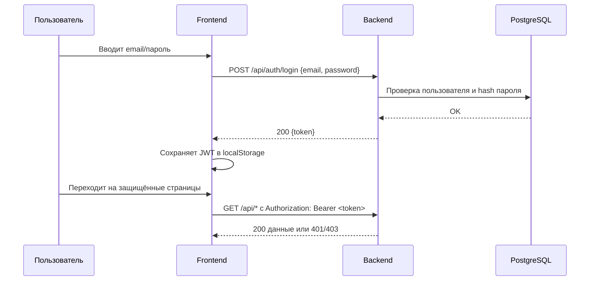
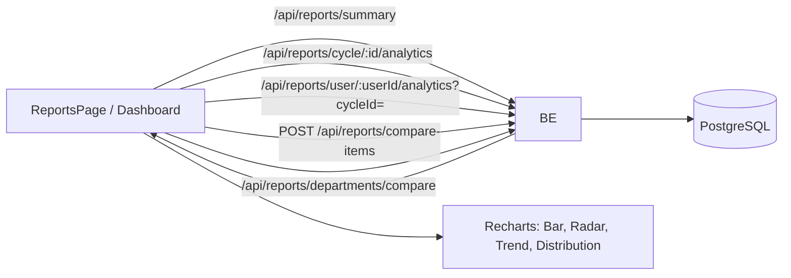

# БИТ.Цифра: Система 360-градусной оценки персонала

Современная веб-система для проведения 360-градусной оценки персонала с интеграцией с Mattermost.

## 🚀 Возможности

- **360-градусная оценка**: Комплексная система оценки сотрудников
- **Интеграция с Mattermost**: Автоматические уведомления и взаимодействие через бот
- **Управление циклами оценки**: Создание и управление периодами оценки
- **Аналитика и отчеты**: Детальные отчеты и визуализация результатов
- **Административная панель**: Полное управление системой
- **Безопасность**: JWT аутентификация и защита данных

## 🛠 Технологии

### Backend
- **Node.js** + **TypeScript**
- **Express.js** - веб-фреймворк
- **PostgreSQL** - основная база данных
- **Redis** - кэширование (опционально)
- **Knex.js** - ORM и миграции
- **JWT** - аутентификация

### Frontend
- **React** + **TypeScript**
- **React Router** - маршрутизация
- **Axios** - HTTP клиент
- **Recharts** - графики и диаграммы
- **Tailwind CSS** - стилизация

## 🧩 Архитектура

```mermaid
graph TD
  A[Пользователь в браузере] --> B[Frontend (React, порт 3000)]
  B -->|Axios /api/*| C[Backend (Express, порт 3001)]
  C --> D[(PostgreSQL)]
  C --> E[(Redis)]
  C --> F[ Mattermost API ]
  B -->|JWT в localStorage| B
  C -->|CRON нотификации| F
```

### JWT аутентификация (последовательность)



### Потоки данных отчетов и аналитики



## 📦 Установка и запуск

### Предварительные требования

- Node.js >= 16.0.0
- PostgreSQL >= 12
- npm или yarn

### Быстрый старт

1. **Клонируйте репозиторий:**
```bash
git clone https://github.com/chastnik/360.git
cd 360
```

2. **Настройте окружение:**
```bash
cp env.example .env
# Отредактируйте .env файл с вашими настройками
```

3. **Запустите систему:**
```bash
./dev.sh
```

Система будет доступна по адресам:
- **Frontend**: http://localhost:3000
- **Backend API**: http://localhost:3001

### Альтернативные способы запуска

#### Продакшн режим
```bash
./start.sh --production
```

#### Docker (рекомендуется для продакшн)
```bash
docker-compose up -d
```

#### Ручной запуск
```bash
# Backend
cd backend && npm run dev

# Frontend (в новом терминале)
cd frontend && npm start
```

## ⚙️ Конфигурация

Основные настройки в `.env` файле:

```env
# База данных
DB_HOST=localhost
DB_NAME=360
DB_USER=360
DB_PASSWORD=your_password
DB_PORT=5432

# Порты
PORT=3001
FRONTEND_PORT=3000

# JWT
JWT_SECRET=your-secret-key

# Frontend
REACT_APP_API_URL=http://localhost:3001/api

# Mattermost интеграция
MATTERMOST_URL=https://your-mattermost-server.com
MATTERMOST_TOKEN=your-token
MATTERMOST_TEAM_ID=your-team-id
```

## 🗄 База данных

### Настройка PostgreSQL

1. Создайте базу данных:
```sql
CREATE DATABASE "360";
CREATE USER "360" WITH PASSWORD 'your_password';
GRANT ALL PRIVILEGES ON DATABASE "360" TO "360";
```

2. Запустите миграции:
```bash
npm run db:migrate
npm run db:seed
```

## 🔧 Разработка

### Структура проекта

```
360/
├── backend/          # Backend API (Node.js + Express)
│   ├── src/
│   │   ├── routes/   # API маршруты
│   │   ├── services/ # Бизнес-логика
│   │   ├── database/ # Миграции и модели
│   │   └── types/    # TypeScript типы
├── frontend/         # Frontend (React)
│   └── src/
│       ├── components/ # React компоненты
│       ├── pages/     # Страницы приложения
│       └── services/  # API клиент
└── docker-compose.yml # Docker конфигурация
```

### Полезные команды

```bash
# Установка зависимостей
npm run install:all

# Запуск в режиме разработки
./dev.sh

# Сборка проекта
npm run build

# Миграции базы данных
npm run db:migrate

# Заполнение тестовыми данными
npm run db:seed

# Линтинг
npm run lint
```

## 🔌 API Документация

### Основные эндпоинты

- `POST /api/auth/login` - Аутентификация
- `GET /api/users` - Список пользователей
- `GET /api/cycles` - Циклы оценки
- `POST /api/assessments` - Создание оценки
- `GET /api/reports/:id` - Получение сохраненного отчета
- `GET /api/reports/summary` - Сводка для дашборда (пользователи, циклы, участники, ответы, общий средний)
- `GET /api/reports/cycle/:cycleId/analytics` - Аналитика по конкретному циклу
- `GET /api/reports/user/:userId/analytics?cycleId=` - Аналитика по одному сотруднику (последний цикл или указанный)
- `POST /api/reports/compare-items` - Сравнение нескольких сотрудников (в т.ч. из разных циклов)
- `GET /api/reports/departments/compare?cycleId=&departmentIds=` - Сравнение отделов

### Примеры запросов

```javascript
// Аутентификация
POST /api/auth/login
{
  "username": "admin",
  "password": "password"
}

// Создание цикла оценки
POST /api/cycles
{
  "name": "Q1 2024 Assessment",
  "start_date": "2024-01-01",
  "end_date": "2024-03-31"
}

// Аналитика цикла
GET /api/reports/cycle/a544e33a-dee5-45cd-91ab-ba478b05bd8d/analytics

// Аналитика сотрудника (последний цикл)
GET /api/reports/user/550e8400-e29b-41d4-a716-446655440200/analytics

// Аналитика сотрудника в указанном цикле
GET /api/reports/user/550e8400-e29b-41d4-a716-446655440200/analytics?cycleId=a544e33a-dee5-45cd-91ab-ba478b05bd8d

// Сравнение произвольного набора сотрудников
POST /api/reports/compare-items
{
  "items": [
    {"userId": "...", "cycleId": "..."},
    {"userId": "..."}
  ]
}

// Сравнение отделов
GET /api/reports/departments/compare?cycleId=...&departmentIds=dep1,dep2
```

## 🤖 Интеграция с Mattermost

Система поддерживает интеграцию с Mattermost для:

- Автоматических уведомлений о новых оценках
- Напоминаний о незавершенных оценках
- Публикации результатов (с настройкой приватности)

### Настройка бота

1. Создайте бота в Mattermost
2. Получите токен доступа
3. Добавьте настройки в `.env` файл
4. Настройте команды в административной панели

## 📊 Мониторинг

Система включает встроенный мониторинг:

```bash
# Запуск мониторинга
./monitoring.sh

# Просмотр логов
tail -f backend/logs/application.log
```

## 🚀 Деплой

### Docker (рекомендуется)

```bash
# Сборка и запуск
docker-compose -f docker-compose.yml up -d

# Просмотр логов
docker-compose logs -f
```

### Ручной деплой

```bash
# Сборка
npm run build

# Запуск в продакшн режиме
NODE_ENV=production npm start
```

## 🤝 Вклад в проект

1. Fork репозитория
2. Создайте feature branch (`git checkout -b feature/amazing-feature`)
3. Commit изменения (`git commit -m 'Add amazing feature'`)
4. Push в branch (`git push origin feature/amazing-feature`)
5. Создайте Pull Request

## 📝 Лицензия

Этот проект лицензирован под MIT License - см. файл [LICENSE](LICENSE) для деталей.

## 🆘 Поддержка

Если у вас возникли проблемы:

1. Проверьте [Issues](https://github.com/chastnik/360/issues)
2. Создайте новый Issue с детальным описанием
3. Или свяжитесь с командой разработки

## 📈 Roadmap

- [ ] Мобильное приложение
- [ ] Интеграция с Active Directory
- [ ] Расширенная аналитика
- [ ] Multi-tenant поддержка
- [ ] API v2 с GraphQL

## 🖥 UI и страницы

- `/dashboard` — дашборд со сводкой и графиками.
- `/reports` — отчеты и аналитика:
  - вкладка «Аналитика цикла»
  - вкладка «Аналитика сотрудника» (поиск, выбор цикла, графики, ответы)
  - вкладка «Сравнение сотрудников» (в т.ч. радар с наложением)
  - вкладка «Сравнение отделов»
- `/employee/:userId` — детальная аналитика сотрудника.

---

**Система 360-градусной оценки персонала** - современное решение для HR-процессов вашей компании.