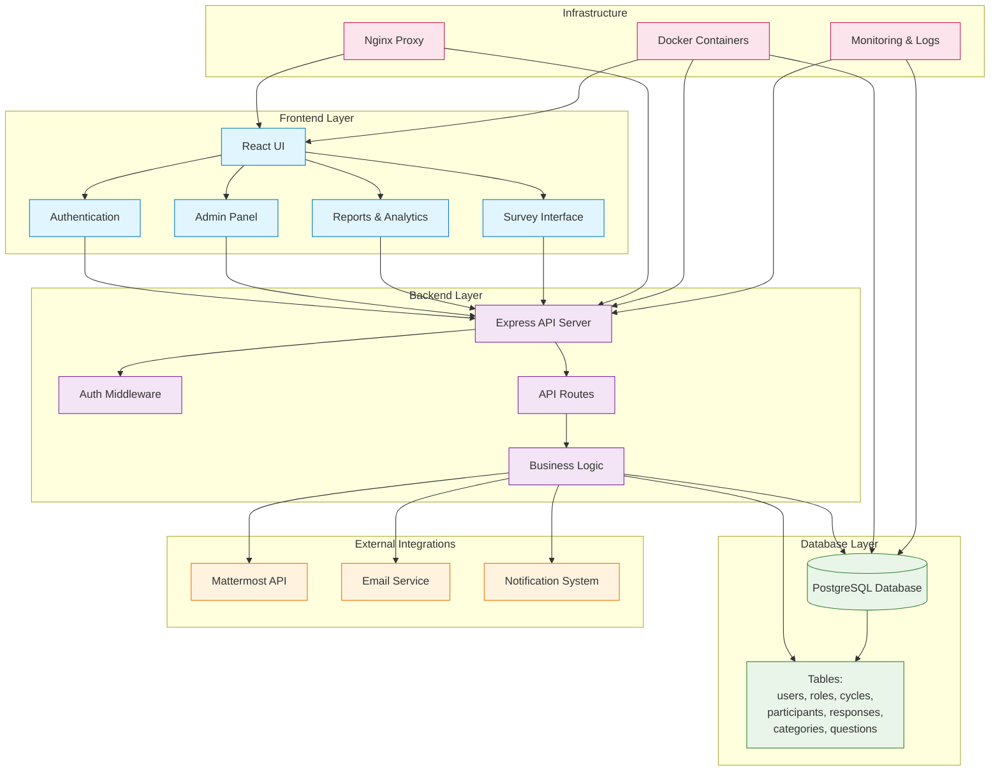
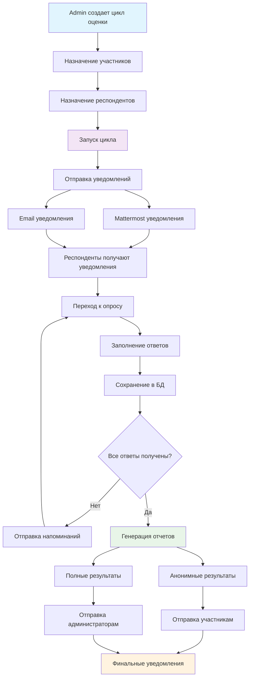
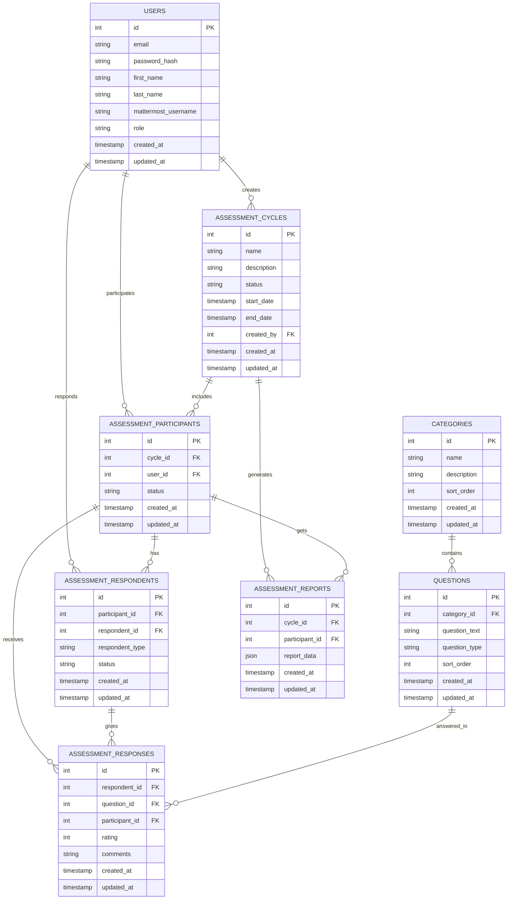

# Система 360-градусной оценки персонала

## Описание
Комплексная система для проведения 360-градусной оценки сотрудников с поддержкой множественных респондентов, детальной аналитикой и интеграцией с Mattermost.

## Функциональность

### ✅ Реализованные функции
- **Аутентификация и авторизация**: Регистрация, вход, смена пароля
- **Управление пользователями**: Роли (admin, hr, user), профили
- **Система циклов оценки**: Создание, управление, запуск циклов
- **Участники и респонденты**: Назначение оценщиков для каждого участника
- **Система опросов**: Интерактивное прохождение с автосохранением
- **Отчеты и аналитика**: Графики, средние баллы, сравнения
- **📱 Mattermost интеграция**: Автоматические уведомления и синхронизация

### 🔄 В разработке
- Административная панель
- Развертывание в production
- Автоматизированные тесты

## Новая функция: Интеграция с Mattermost

### Возможности
- **Автоматические уведомления**: При запуске циклов и завершении оценок
- **Синхронизация пользователей**: Импорт из Mattermost команды
- **Персонализированные сообщения**: Прямые сообщения с кнопками действий
- **Напоминания**: Для незавершенных опросов
- **Статистика интеграции**: Мониторинг статуса подключения

### Типы уведомлений
1. **🎯 Запуск цикла**: Уведомления участникам и респондентам
2. **📝 Требуется оценка**: Персональные уведомления респондентам
3. **⏰ Напоминания**: Для незавершенных опросов
4. **✅ Завершение оценки**: Когда все респонденты завершили оценку

### Настройка
См. подробную инструкцию в файле [`MATTERMOST_SETUP.md`](MATTERMOST_SETUP.md)

## Архитектура

### Схема системы



### Поток данных системы оценки



### Backend
- **Node.js + Express**: REST API сервер
- **PostgreSQL**: База данных
- **Knex.js**: Query builder и миграции
- **TypeScript**: Типизация
- **JWT**: Аутентификация
- **Axios**: HTTP клиент для Mattermost API

### Frontend
- **React + TypeScript**: Пользовательский интерфейс
- **React Router**: Маршрутизация
- **Tailwind CSS**: Стилизация
- **Recharts**: Графики и визуализация
- **Axios**: HTTP клиент

### База данных



#### Описание таблиц:
- **users**: Пользователи системы (с поддержкой mattermost_username)
- **categories**: Категории компетенций
- **questions**: Вопросы для оценки
- **assessment_cycles**: Циклы оценки
- **assessment_participants**: Участники циклов
- **assessment_respondents**: Респонденты для каждого участника
- **assessment_responses**: Ответы на вопросы
- **assessment_reports**: Сгенерированные отчеты

## Установка и запуск

### Предварительные требования
- Node.js 16+
- PostgreSQL 12+
- Доступ к серверу Mattermost (опционально)

### Установка

```bash
# Клонировать репозиторий
git clone <repository-url>
cd 360-assessment-system

# Установить зависимости
npm run install:all

# Настроить переменные окружения
cp backend/.env.example backend/.env
# Отредактировать backend/.env

# Запустить базу данных и выполнить миграции
npm run db:migrate
npm run db:seed

# Запустить в режиме разработки
npm run dev
```

### Конфигурация Mattermost

```bash
# Добавить в backend/.env
MATTERMOST_URL=https://mattermost.company.com
MATTERMOST_TOKEN=your_personal_access_token
MATTERMOST_TEAM_ID=your_team_id
MATTERMOST_BOT_USERNAME=360-assessment-bot
```

## 🚀 Развертывание

### Требования
- Docker 20.10+
- Docker Compose 2.0+
- 4GB RAM (рекомендуется 8GB)
- 20GB свободного места на диске

### Быстрый старт

1. **Клонирование репозитория**
```bash
git clone <repository-url>
cd 360-assessment-system
```

2. **Настройка переменных окружения**
```bash
cp env.example .env
# Отредактируйте .env файл и настройте переменные
```

3. **Запуск системы**
```bash
chmod +x deploy.sh
./deploy.sh start
```

4. **Проверка статуса**
```bash
./deploy.sh status
```

### Доступ к системе
- **Frontend**: http://localhost
- **Backend API**: http://localhost:5000/api
- **Database**: localhost:5432
- **Redis**: localhost:6379

### Управление

```bash
# Запуск системы
./deploy.sh start

# Остановка системы
./deploy.sh stop

# Перезапуск системы
./deploy.sh restart

# Просмотр логов
./deploy.sh logs

# Создание резервной копии
./deploy.sh backup

# Проверка состояния
./deploy.sh status
```

### Мониторинг

```bash
# Единоразовая проверка
./monitoring.sh monitor

# Непрерывный мониторинг
./monitoring.sh continuous

# Генерация отчета
./monitoring.sh report
```

### Дополнительная информация

Подробная документация по развертыванию доступна в [DEPLOYMENT.md](DEPLOYMENT.md)

## 🔧 Конфигурация

### Переменные окружения

**Обязательные переменные:**
- `DB_PASSWORD` - пароль для базы данных
- `JWT_SECRET` - секретный ключ для JWT (минимум 32 символа)
- `MATTERMOST_URL` - URL сервера Mattermost
- `MATTERMOST_TOKEN` - Personal Access Token для Mattermost
- `MATTERMOST_TEAM_ID` - ID команды в Mattermost

**Опциональные переменные:**
- `FRONTEND_PORT` - порт для frontend (по умолчанию 80)
- `BACKEND_PORT` - порт для backend (по умолчанию 5000)
- `REDIS_PASSWORD` - пароль для Redis
- `SSL_CERT_PATH` - путь к SSL сертификату
- `SSL_KEY_PATH` - путь к SSL ключу

### Настройка HTTPS

Для production рекомендуется использовать HTTPS:

```bash
# Создание самоподписанного сертификата
openssl req -x509 -nodes -days 365 -newkey rsa:2048 \
  -keyout ssl/private.key -out ssl/certificate.crt
```

Или используйте Let's Encrypt:

```bash
certbot certonly --webroot -w /var/www/html -d your-domain.com
```

## 📊 Мониторинг и логирование

### Просмотр логов

```bash
# Все логи
docker-compose logs

# Логи конкретного сервиса
docker-compose logs backend
docker-compose logs frontend
docker-compose logs database

# Логи в реальном времени
docker-compose logs -f backend
```

### Проверка здоровья

```bash
# Проверка всех сервисов
curl http://localhost/health
curl http://localhost:5000/api/health

# Проверка базы данных
docker-compose exec database pg_isready -U assessment_user -d assessment360
```

### Использование ресурсов

```bash
# Статистика контейнеров
docker stats

# Использование дискового пространства
docker system df
```

## 🔒 Безопасность

### Рекомендации по безопасности

1. **Измените пароли по умолчанию**
   - Используйте сложные пароли для базы данных
   - Генерируйте случайный JWT_SECRET

2. **Настройте HTTPS**
   - Используйте валидные SSL сертификаты
   - Настройте редирект с HTTP на HTTPS

3. **Ограничьте доступ к портам**
   - Используйте firewall для ограничения доступа
   - Закройте неиспользуемые порты

4. **Регулярно обновляйте систему**
   - Обновляйте Docker образы
   - Применяйте security patches

5. **Настройте резервное копирование**
   - Автоматические резервные копии
   - Тестирование восстановления

## 🔄 Обновление системы

### Обновление до новой версии

```bash
# Остановка системы
./deploy.sh stop

# Обновление кода
git pull origin main

# Пересборка образов
./deploy.sh build

# Запуск системы
./deploy.sh start
```

### Автоматическое обновление

```bash
# Использование встроенной команды
./deploy.sh update
```

## 📋 Планы развития

- [ ] Многоязычность
- [x] **Интеграция с Mattermost**
- [x] **Административная панель**
- [x] **Система развертывания**
- [x] **Мониторинг и логирование**
- [ ] **Тестирование**
- [ ] API для интеграции с HR системами
- [ ] Мобильное приложение
- [ ] Расширенная аналитика
- [ ] Система уведомлений по email

## Лицензия

MIT License

## Поддержка

Для вопросов и предложений создавайте Issues в репозитории. 