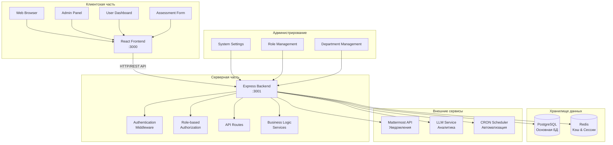
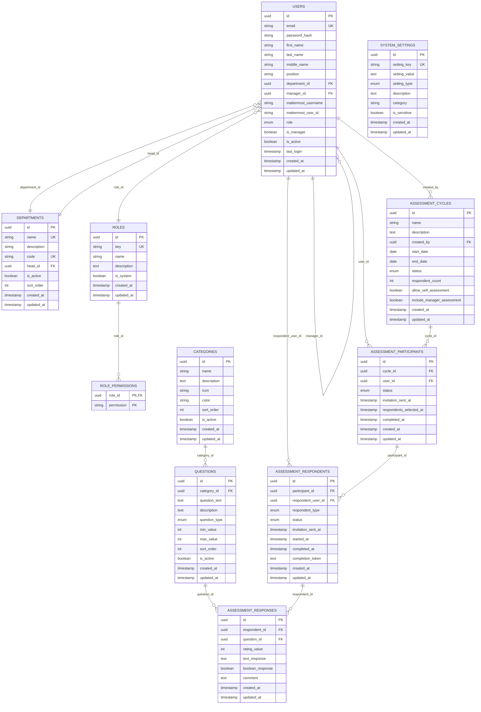
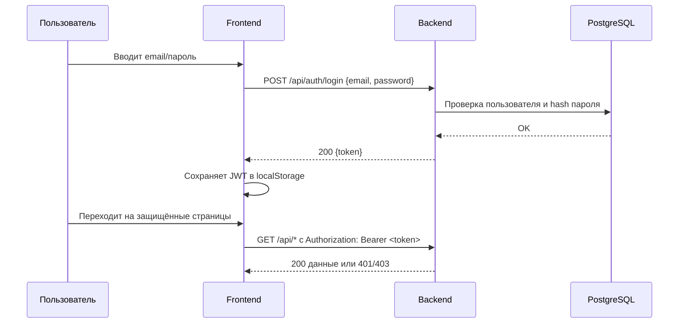
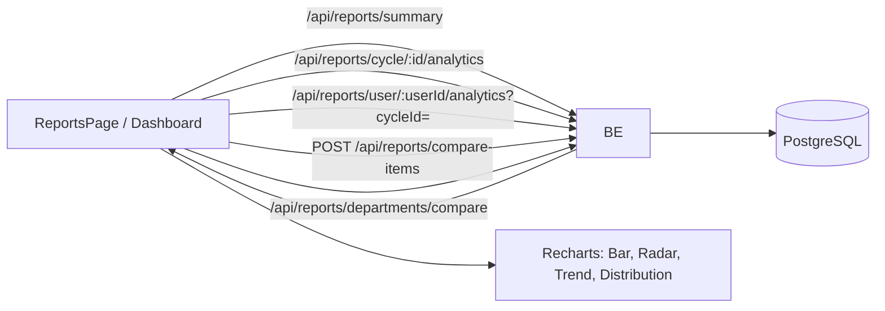
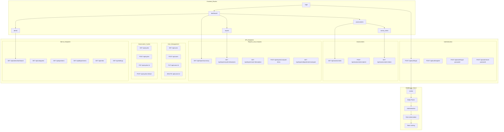

# БИТ.Цифра: Система 360-градусной оценки персонала

Современная веб-система для проведения 360-градусной оценки персонала с интеграцией с Mattermost.

## 🚀 Возможности

### Основные функции
- **360-градусная оценка**: Комплексная система оценки сотрудников со всех сторон
- **Интерактивный выбор респондентов**: Выбор оценщиков через Mattermost-бота с поиском
- **Автоматизированные циклы**: Полный цикл от создания до отчетов с автоматизацией
- **Многоуровневая аналитика**: Индивидуальные, командные и межотдельские отчеты

### Управление персоналом
- **Система ролей**: Admin, HR, Manager, User с гранулярными правами
- **Управление отделами**: Иерархическая структура с руководителями
- **Профили сотрудников**: Полные профили с интеграцией Mattermost

### Интеграция и автоматизация
- **Mattermost интеграция**: Умный бот для выбора респондентов и уведомлений
- **Автоматические напоминания**: Настраиваемые уведомления о незавершенных оценках
- **CRON планировщик**: Автоматические задачи и мониторинг процессов

### Аналитика и отчетность
- **Интерактивные дашборды**: Визуализация данных с Recharts
- **Сравнительная аналитика**: Сравнение сотрудников и отделов
- **LLM-анализ**: Умная обработка текстовых ответов (в разработке)
- **Экспорт данных**: Различные форматы для дальнейшего анализа

### Администрирование
- **Гибкая конфигурация**: Настройка вопросов, категорий, параметров
- **Система настроек**: Централизованное управление конфигурацией
- **Мониторинг системы**: Отслеживание производительности и ошибок
- **Безопасность**: JWT аутентификация, защита данных, аудит действий

## 🛠 Технологии

### Backend
- **Node.js** + **TypeScript** - основная среда выполнения
- **Express.js** - веб-фреймворк с middleware
- **PostgreSQL** - основная база данных с UUID
- **Redis** - кэширование и сессии (опционально)
- **Knex.js** - ORM, миграции и query builder
- **JWT** - статeless аутентификация
- **Bcrypt** - хэширование паролей
- **node-cron** - планировщик задач

### Frontend
- **React** + **TypeScript** - основной UI фреймворк
- **React Router v6** - клиентская маршрутизация
- **Axios** - HTTP клиент с interceptors
- **Recharts** - графики и диаграммы
- **Tailwind CSS** - utility-first стилизация
- **React Context** - управление состоянием

### Интеграции
- **Mattermost API** - корпоративный мессенджер
- **LLM Services** - обработка естественного языка
- **Docker** - контейнеризация (опционально)

### DevOps
- **ESLint** + **Prettier** - качество кода
- **Git** - система контроля версий
- **Shell Scripts** - автоматизация развертывания

## 🧩 Архитектура системы

### Общая архитектура



### Структура базы данных



### JWT аутентификация (последовательность)



### Процесс 360-градусной оценки

```mermaid
flowchart TD
  subgraph "Этап 1: Подготовка"
    A1[Администратор создает<br/>цикл оценки] --> A2[Настройка параметров<br/>цикла]
    A2 --> A3[Выбор участников]
    A3 --> A4[Активация цикла]
  end
  
  subgraph "Этап 2: Выбор респондентов"
    A4 --> B1[Участники получают<br/>уведомления в Mattermost]
    B1 --> B2[Участник выбирает<br/>респондентов через бота]
    B2 --> B3{Минимум 4<br/>респондента?}
    B3 -->|Нет| B2
    B3 -->|Да| B4[Подтверждение<br/>списка респондентов]
  end
  
  subgraph "Этап 3: Проведение оценки"
    B4 --> C1[Респонденты получают<br/>уведомления с ссылками]
    C1 --> C2[Респондент заполняет<br/>форму оценки]
    C2 --> C3{Все категории<br/>заполнены?}
    C3 -->|Нет| C2
    C3 -->|Да| C4[Оценка сохранена]
  end
  
  subgraph "Этап 4: Мониторинг"
    C4 --> D1[Автоматические напоминания<br/>неответившим]
    D1 --> D2{Все респонденты<br/>ответили?}
    D2 -->|Нет| D1
    D2 -->|Да| D3[Участник помечается<br/>как завершен]
  end
  
  subgraph "Этап 5: Результаты"
    D3 --> E1[Генерация отчетов<br/>и аналитики]
    E1 --> E2[Уведомления о<br/>готовности результатов]
    E2 --> E3[Доступ к детальным<br/>отчетам и дашбордам]
  end
  
  style A4 fill:#e1f5fe
  style C4 fill:#f1f8e9
  style E3 fill:#fff3e0
```



### Система ролей и разрешений

```mermaid
graph TB
  subgraph "Роли в системе"
    R1[Admin<br/>Полные права]
    R2[HR<br/>Управление персоналом]
    R3[Manager<br/>Управление командой]
    R4[User<br/>Базовые права]
  end
  
  subgraph "Разрешения Admin"
    P1[Управление пользователями]
    P2[Управление системными настройками]
    P3[Управление ролями]
    P4[Управление отделами]
    P5[Создание/изменение циклов]
    P6[Доступ ко всем отчетам]
    P7[Управление категориями и вопросами]
    P8[Интеграция с Mattermost]
  end
  
  subgraph "Разрешения HR"
    P9[Просмотр пользователей]
    P10[Создание циклов оценки]
    P11[Просмотр отчетов отделов]
    P12[Управление участниками]
  end
  
  subgraph "Разрешения Manager"
    P13[Просмотр своей команды]
    P14[Участие в оценке]
    P15[Просмотр отчетов подчиненных]
  end
  
  subgraph "Разрешения User"
    P16[Участие в оценке]
    P17[Просмотр своих результатов]
    P18[Заполнение форм оценки]
  end
  
  R1 --> P1
  R1 --> P2
  R1 --> P3
  R1 --> P4
  R1 --> P5
  R1 --> P6
  R1 --> P7
  R1 --> P8
  
  R2 --> P9
  R2 --> P10
  R2 --> P11
  R2 --> P12
  
  R3 --> P13
  R3 --> P14
  R3 --> P15
  
  R4 --> P16
  R4 --> P17
  R4 --> P18
  
  style R1 fill:#ffebee
  style R2 fill:#e8f5e8
  style R3 fill:#fff3e0
  style R4 fill:#e3f2fd
```



### Потоки данных отчетов и аналитики



### API Архитектура



### Интеграция с Mattermost

```mermaid
sequenceDiagram
  actor Admin
  participant System
  participant MM
  participant Participant
  participant Respondent
  
  rect rgb(240, 248, 255)
    note right of Admin: Этап 1: Создание цикла
    Admin->>System: Создает цикл оценки
    Admin->>System: Выбирает участников
    Admin->>System: Активирует цикл
  end
  
  rect rgb(248, 255, 240)
    note right of System: Этап 2: Уведомления участников
    System->>MM: Отправляет список участников
    MM->>Participant: Начался цикл оценки. Выберите респондентов
    Participant->>MM: Вводит критерии поиска username email ФИО
    MM->>System: Запрос поиска пользователей
    System->>MM: Возвращает найденных пользователей
    MM->>Participant: Показывает варианты для выбора
    Participant->>MM: Подтверждает выбранных респондентов
    MM->>System: Сохраняет список респондентов
  end
  
  rect rgb(255, 248, 240)
    note right of System: Этап 3: Уведомления респондентов
    System->>MM: Генерирует токены для оценки
    MM->>Respondent: Вас пригласили для оценки участника
    MM->>Respondent: Отправляет ссылку с токеном
    Respondent->>System: Переходит по ссылке
    Respondent->>System: Заполняет форму оценки
    System->>MM: Уведомление о завершении
  end
  
  rect rgb(255, 240, 248)
    note right of System: Этап 4: Напоминания и отчеты
    System->>MM: Ежедневные напоминания 10 00
    MM->>Respondent: Напоминание о незавершенной оценке
    System->>MM: Уведомление о готовности отчета
    MM->>Participant: Ваш отчет готов
    MM->>Admin: Отчеты по циклу готовы
  end
  
  style MM fill:#e1f5fe
  style System fill:#f1f8e9
```

## 📦 Установка и запуск

### Предварительные требования

- Node.js >= 16.0.0
- PostgreSQL >= 12
- npm или yarn

### Быстрый старт

1. **Клонируйте репозиторий:**
```bash
git clone https://github.com/chastnik/360.git
cd 360
```

2. **Настройте окружение:**
```bash
cp env.example .env
# Отредактируйте .env файл с вашими настройками
```

3. **Запустите систему:**
```bash
./dev.sh
```

Система будет доступна по адресам:
- **Frontend**: http://localhost:3000
- **Backend API**: http://localhost:3001

### Альтернативные способы запуска

#### Продакшн режим
```bash
./start.sh --production
```

#### Docker (рекомендуется для продакшн)
```bash
docker-compose up -d
```

#### Ручной запуск
```bash
# Backend
cd backend && npm run dev

# Frontend (в новом терминале)
cd frontend && npm start
```

## ⚙️ Конфигурация

Основные настройки в `.env` файле:

```env
# База данных
DB_HOST=localhost
DB_NAME=360
DB_USER=360
DB_PASSWORD=your_password
DB_PORT=5432

# Порты
PORT=3001
FRONTEND_PORT=3000

# JWT
JWT_SECRET=your-secret-key

# Frontend
REACT_APP_API_URL=http://localhost:3001/api

# Mattermost интеграция
MATTERMOST_URL=https://your-mattermost-server.com
MATTERMOST_TOKEN=your-token
MATTERMOST_TEAM_ID=your-team-id
```

## 🗄 База данных

### Настройка PostgreSQL

1. Создайте базу данных:
```sql
CREATE DATABASE "360";
CREATE USER "360" WITH PASSWORD 'your_password';
GRANT ALL PRIVILEGES ON DATABASE "360" TO "360";
```

2. Запустите миграции:
```bash
npm run db:migrate
npm run db:seed
```

## 🔧 Разработка

### Структура проекта

```
360/
├── backend/          # Backend API (Node.js + Express)
│   ├── src/
│   │   ├── routes/   # API маршруты
│   │   ├── services/ # Бизнес-логика
│   │   ├── database/ # Миграции и модели
│   │   └── types/    # TypeScript типы
├── frontend/         # Frontend (React)
│   └── src/
│       ├── components/ # React компоненты
│       ├── pages/     # Страницы приложения
│       └── services/  # API клиент
└── docker-compose.yml # Docker конфигурация
```

### Полезные команды

```bash
# Установка зависимостей
npm run install:all

# Запуск в режиме разработки
./dev.sh

# Сборка проекта
npm run build

# Миграции базы данных
npm run db:migrate

# Заполнение тестовыми данными
npm run db:seed

# Линтинг
npm run lint
```

## 🔌 API Документация

### Основные эндпоинты

#### Аутентификация
- `POST /api/auth/login` - Вход в систему
- `POST /api/auth/register` - Регистрация нового пользователя
- `POST /api/auth/forgot-password` - Восстановление пароля
- `POST /api/auth/reset-password` - Сброс пароля по токену

#### Пользователи и роли
- `GET /api/users` - Список пользователей (с фильтрацией и пагинацией)
- `POST /api/users` - Создание пользователя
- `PUT /api/users/:id` - Обновление данных пользователя
- `DELETE /api/users/:id` - Деактивация пользователя
- `GET /api/roles` - Управление ролями и разрешениями

#### Отделы
- `GET /api/departments` - Список отделов
- `POST /api/departments` - Создание отдела
- `PUT /api/departments/:id` - Обновление отдела

#### Циклы оценки
- `GET /api/cycles` - Все циклы оценки
- `POST /api/cycles` - Создание цикла
- `PUT /api/cycles/:id` - Обновление цикла
- `POST /api/cycles/:id/start` - Запуск цикла оценки
- `POST /api/cycles/:id/participants` - Управление участниками

#### Оценки
- `GET /api/assessments` - Доступные оценки для пользователя
- `GET /api/assessments/:token` - Получение формы оценки по токену
- `POST /api/assessments/submit` - Отправка заполненной оценки

#### Отчеты и аналитика
- `GET /api/reports/summary` - Общая сводка для дашборда
- `GET /api/reports/cycle/:id/analytics` - Детальная аналитика по циклу
- `GET /api/reports/user/:id/analytics` - Индивидуальная аналитика сотрудника  
- `POST /api/reports/compare-items` - Сравнение произвольного набора сотрудников
- `GET /api/reports/departments/compare` - Сравнительная аналитика отделов

#### Администрирование
- `GET /api/admin/dashboard` - Административная панель
- `GET /api/categories` - Управление категориями вопросов
- `GET /api/questions` - Управление вопросами
- `GET /api/settings` - Системные настройки
- `POST /api/mattermost/webhook` - Webhook для интеграции с Mattermost

### Примеры запросов

```javascript
// Аутентификация
POST /api/auth/login
{
  "username": "admin",
  "password": "password"
}

// Создание цикла оценки
POST /api/cycles
{
  "name": "Q1 2024 Assessment",
  "start_date": "2024-01-01",
  "end_date": "2024-03-31"
}

// Аналитика цикла
GET /api/reports/cycle/a544e33a-dee5-45cd-91ab-ba478b05bd8d/analytics

// Аналитика сотрудника (последний цикл)
GET /api/reports/user/550e8400-e29b-41d4-a716-446655440200/analytics

// Аналитика сотрудника в указанном цикле
GET /api/reports/user/550e8400-e29b-41d4-a716-446655440200/analytics?cycleId=a544e33a-dee5-45cd-91ab-ba478b05bd8d

// Сравнение произвольного набора сотрудников
POST /api/reports/compare-items
{
  "items": [
    {"userId": "...", "cycleId": "..."},
    {"userId": "..."}
  ]
}

// Сравнение отделов
GET /api/reports/departments/compare?cycleId=...&departmentIds=dep1,dep2
```

## 🤖 Интеграция с Mattermost

Система поддерживает интеграцию с Mattermost для:

- Автоматических уведомлений о новых оценках
- Напоминаний о незавершенных оценках
- Публикации результатов (с настройкой приватности)

### Настройка бота

1. Создайте бота в Mattermost
2. Получите токен доступа
3. Добавьте настройки в `.env` файл
4. Настройте команды в административной панели

## 📊 Мониторинг

Система включает встроенный мониторинг:

```bash
# Запуск мониторинга
./monitoring.sh

# Просмотр логов
tail -f backend/logs/application.log
```

## 🚀 Деплой

### Docker (рекомендуется)

```bash
# Сборка и запуск
docker-compose -f docker-compose.yml up -d

# Просмотр логов
docker-compose logs -f
```

### Ручной деплой

```bash
# Сборка
npm run build

# Запуск в продакшн режиме
NODE_ENV=production npm start
```

## 🤝 Вклад в проект

1. Fork репозитория
2. Создайте feature branch (`git checkout -b feature/amazing-feature`)
3. Commit изменения (`git commit -m 'Add amazing feature'`)
4. Push в branch (`git push origin feature/amazing-feature`)
5. Создайте Pull Request

## 📝 Лицензия

Этот проект лицензирован под MIT License - см. файл [LICENSE](LICENSE) для деталей.

## 🆘 Поддержка

Если у вас возникли проблемы:

1. Проверьте [Issues](https://github.com/chastnik/360/issues)
2. Создайте новый Issue с детальным описанием
3. Или свяжитесь с командой разработки

## 📈 Roadmap

- [ ] Мобильное приложение
- [ ] Интеграция с Active Directory
- [ ] Расширенная аналитика
- [ ] Multi-tenant поддержка
- [ ] API v2 с GraphQL

## 🖥 UI и страницы

### Пользовательские страницы
- `/dashboard` — главная панель со сводкой, графиками и последней активностью
- `/profile` — личный профиль пользователя с возможностью редактирования
- `/assessments` — доступные оценки для заполнения
- `/cycles` — просмотр циклов оценки (участник/респондент)

### Отчетность и аналитика  
- `/reports` — центр аналитики с множественными вкладками:
  - **Аналитика цикла** — детальные метрики по конкретному циклу
  - **Аналитика сотрудника** — индивидуальные профили с поиском и фильтрацией
  - **Сравнение сотрудников** — многомерное сравнение с радарными диаграммами
  - **Сравнение отделов** — межотдельская аналитика и бенчмаркинг
- `/employee/:userId` — персональная страница аналитики сотрудника

### Административные страницы
- `/admin` — главная административная панель с метриками системы
- `/admin/users` — управление пользователями (CRUD, роли, активация)
- `/admin/departments` — управление структурой отделов
- `/admin/roles` — настройка ролей и разрешений
- `/admin/categories` — управление категориями вопросов
- `/admin/questions` — редактор вопросов для оценки
- `/admin/mattermost` — настройки интеграции с Mattermost
- `/admin/settings` — системные настройки и конфигурация

### Специальные страницы
- `/survey/:token` — публичная форма для заполнения оценки
- `/report/:token` — публичный просмотр отчета по токену
- `/login` — страница входа в систему
- `/register` — регистрация новых пользователей
- `/forgot-password` — восстановление пароля

---

**Система 360-градусной оценки персонала** - современное решение для HR-процессов вашей компании.